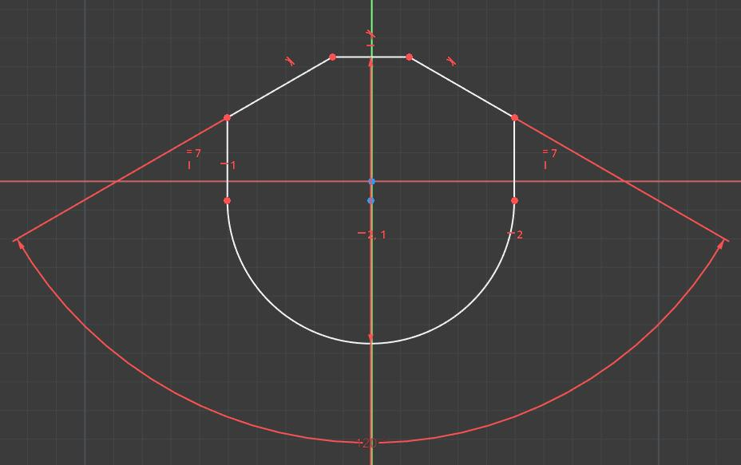

# FreeCAD Teardrop Macro

This is simple FreeCAD Sketcher macro to create so-called teardrop shapes, which are semi-round holes that can be 3D-printed vertically without supports.
Both **trimmed** and **pointy** teardrops can be created.

After creating the teardrop, constrain any of its points to fully constrain it. Otherwise it has 2 DoF.

The angle of the teardrop can be adjusted after creation by adjusting the angle between the two slants (double angle). i.e. to change from 45 to 60, change the angle from 90 to 120. The inner radius can also be adjusted by changing the diameter constraint.

The teardrop always **contains** (and do not cross) the hole with the specified diameter.

## Examples

### Trimmed Teardrop

Trimmed teardrop work well for smaller holes by bridging the top part. Long bridges may droop, so you may want to adjust the angle to minimize that.

### Non-Trimmed (Pointy) Teardrop

Non-trimmed (pointy) teardrop do not require any bridges but might be too high if the angle is small (see below for examples).

